<div align="center">
  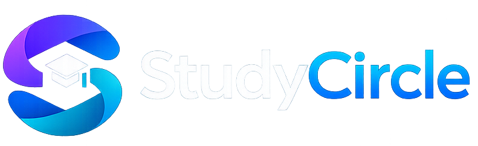
  <h1>StudyCircle</h1>
  <p><strong>Collaborative Study Management Platform for Students</strong></p>
  <p><em>Empowering students with Agile methodologies, Kanban task management, Pomodoro focus, and gamification.</em></p>
  <a href="https://studycircle.my-board.org/" style="font-size: 1.2em; font-weight: bold; color: #007BFF;">vist website (live demo) - <b>https://studycircle.my-board.org/</b></a>
</div>

---

<div align="center">
<strong style="font-size: 1.5em;">🚀 Quick Access</strong>

[🌐 Live Demo](https://studycircle.my-board.org/) • [🔑 Demo Accounts](#-demo-accounts) • [🧪 Testing Report](#-Testing-Report) • [📸 Screenshots](#-screenshots) • [🏗️ System-Architecture](#️-system-architecture)
</div>

---

## 📖 Overview

**StudyCircle** is a comprehensive, collaborative study management platform designed specifically for university students. It bridges the gap between academic productivity and professional software engineering practices by integrating **Agile methodologies**, **Scrum frameworks**, and **Kanban boards** into the daily study routine. 

Whether you are managing a complex software engineering group project, preparing for exams, or tracking individual assignments, StudyCircle provides the tools to visualize workflows, prioritize tasks, and maintain focus.

---

## 🎯 Project Objectives

StudyCircle was designed to solve common academic collaboration and productivity challenges faced by university students while simultaneously applying practical Software Engineering concepts in a real-world inspired environment.

The main objectives of the platform are:

- Improve collaboration between students and study groups.
- Apply Agile and Scrum methodologies practically.
- Enhance productivity using Pomodoro focus techniques.
- Provide a modern Kanban-based workflow management system.
- Encourage motivation and engagement through gamification.
- Simulate real-world software engineering workflows used in industry.
- Improve requirement traceability between tasks, sprints, and software requirements.
- Provide a scalable and maintainable architecture for future expansion.

---

## ✨ Key Features

### 🚀 Agile & Scrum Workspace
Designed with Software Engineering principles in mind, StudyCircle offers a dedicated Agile workspace to manage projects professionally:
- **Sprints & Iterations**: Plan, execute, and review study sprints (e.g., Sprint 0: Foundation, Sprint 1: Active).
- **MoSCoW Prioritization**: Categorize tasks effectively (Must have, Should have, Could have, Won't have).
- **Story Points & Velocity**: Estimate task effort and track team velocity over time.
- **Requirement Traceability**: Link Kanban tasks directly to project requirements (e.g., REQ-001) for full traceability.
- **Scrum Roles**: Assign and manage roles such as Product Owner, Scrum Master, and Team Members.

### 📋 Kanban Task Boards
Visualize your study workflow with intuitive, drag-and-drop Kanban boards:
- Columns for **To Do**, **In Progress**, and **Completed**.
- Detailed task cards featuring MoSCoW priorities, story points, and requirement links.
- Filter tasks by Sprint or Priority.

## 🏗️ System Architecture

StudyCircle follows a Hybrid Software Architecture combining:
- MVC-inspired backend structure
- Repository pattern for database abstraction
- Modular Agile workspace components
- Client-server communication using AJAX

### Level 0
External entities:
- Students
- Admins
- Study Groups

### Level 1
Subsystems:
- Authentication System
- Agile Workspace
- Kanban Management
- Focus & Productivity System
- Stories & Community System
- Resource Sharing System

### Level 2
Each subsystem is divided into reusable modules and services for scalability and maintainability.

## 🔄 Software Development Life Cycle (SDLC)

The StudyCircle platform was developed following a structured Software Engineering process inspired by iterative Agile methodologies.

### 1. Requirement Engineering
The project requirements were collected, analyzed, prioritized, and refined based on the needs of university students and collaborative academic teams.

Techniques used:
- Requirement Elicitation
- Requirement Analysis
- Requirement Negotiation
- MoSCoW Prioritization

### 2. System Analysis
The system behavior and interactions were modeled using:
- Use Case Diagrams
- Use Case Descriptions
- Interaction Scenarios
- Data Flow Diagrams (DFD)

### 3. System Design
The design phase included:
- Architecture Diagrams (Level 0, Level 1, and Level 2)
- Component Design
- UML Class Diagrams
- Sequence Diagrams
- Database Design

### 4. Implementation
The system was implemented using:
- PHP 8+
- SQLite
- Tailwind CSS
- JavaScript
- AJAX-based communication

### 5. Testing
Different software testing strategies were applied:
- Unit Testing
- Integration Testing
- Regression Testing
- Security Testing
- Manual UI Testing

### 6. Deployment
The platform was optimized for shared hosting deployment using lightweight technologies and SQLite persistence.

---

### ⏱️ Pomodoro Focus Timer
Enhance productivity with built-in focus tools:
- Customizable Pomodoro sessions.
- Track focus history and total focus hours.
- 🎵 **Ambient Music Player**: Play calming background music during focus sessions to stay in the zone.
- 📚 **Personal Sound Library**: Add and manage your own audio tracks, and save sounds directly from YouTube to build your perfect study playlist.

### 🎮 Gamification & Engagement
Stay motivated with gamified elements:
- Earn **XP** for completing tasks and focus sessions.
- Maintain daily **Streaks**.
- Unlock **Achievements** and climb the **Leaderboard**.
- Share 24-hour ephemeral **Campus Stories** with your peers.

### 📖 Campus Study Stories
Share your academic journey with the community or Groups:
- Post **ephemeral 24-hour stories** about your study sessions, achievements, and campus life.
- Discover inspiring stories from fellow students to stay motivated.
- React and engage with the campus community in real time.

### 👥 Collaboration & Communication
- **Study Groups**: Create or join groups using invite codes (e.g., CS 301 Study Squad).
- **Group Chat**: Real-time communication with AJAX polling.
- **Resource Sharing**: Upload and share study materials (PDF, JPG, PNG, WEBP).

### 🛡️ Security & Administration
- **Admin Dashboard**: Monitor platform activity, manage users, and view system logs.
- **Robust Security**: Session authentication with CSRF protection, PDO prepared statements, password hashing, and XSS escaping.

---

## 📸 Screenshots

Here is a visual tour of the StudyCircle platform:

### 1. Dashboard & Overview
The central hub for tracking progress, streaks, and active study groups.
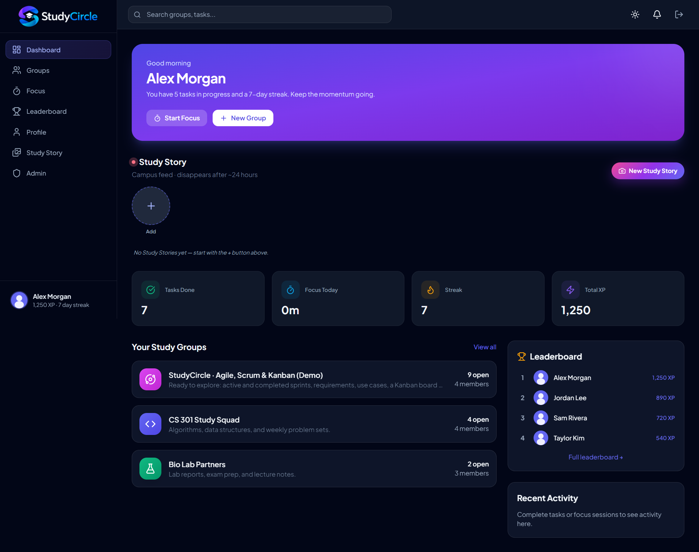

### 2. Group Home
Collaborative space for specific courses or projects.
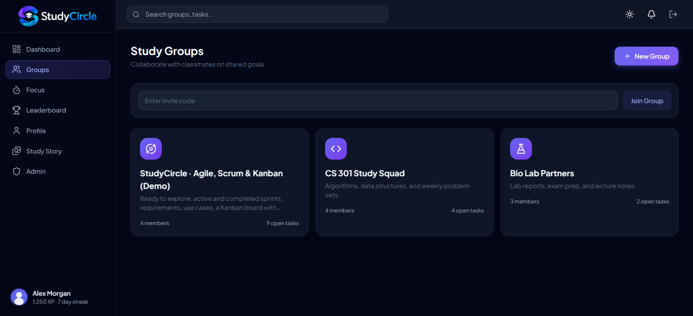

group chat
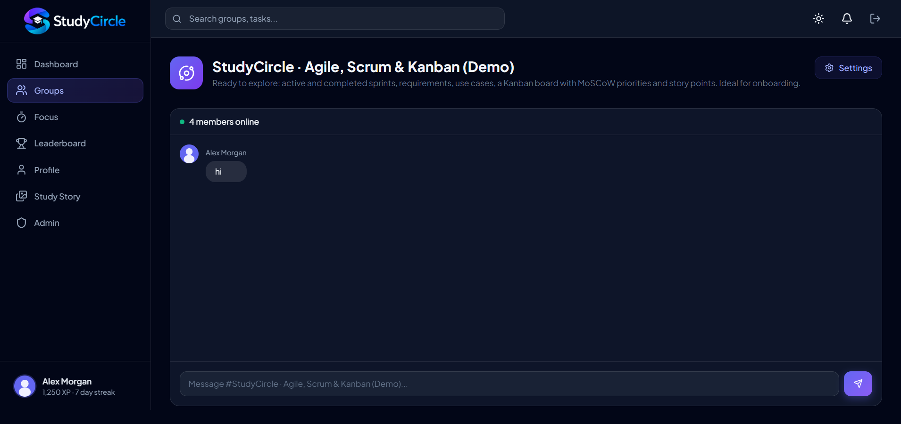

group resources shares
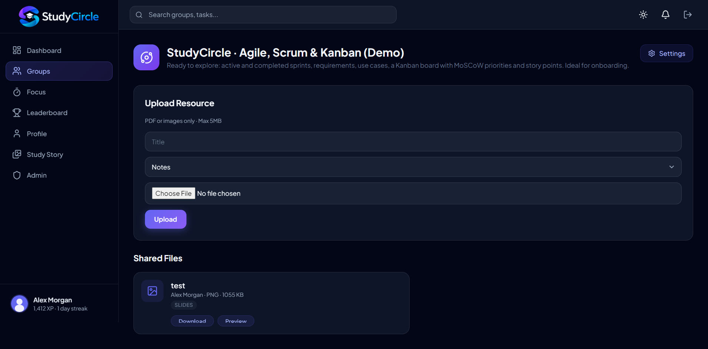


### 3. Agile Workspace (Scrum Cockpit)
Manage sprints, track progress, and align team efforts.
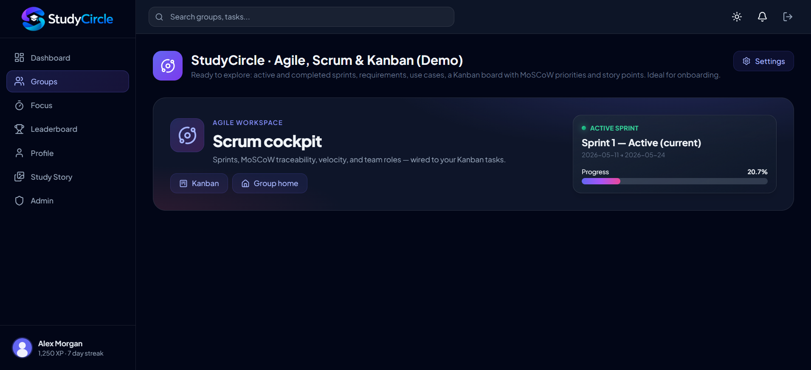

### 4. Kanban Board
Drag-and-drop task management with MoSCoW priorities and story points.
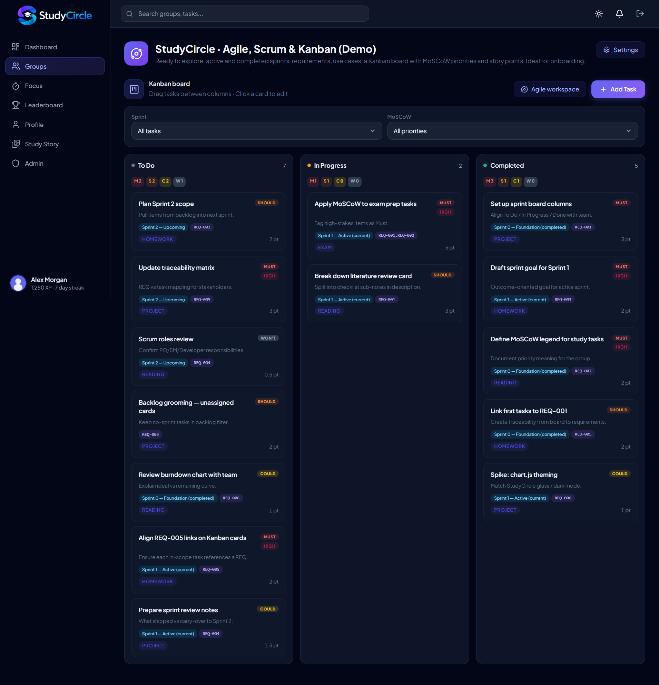

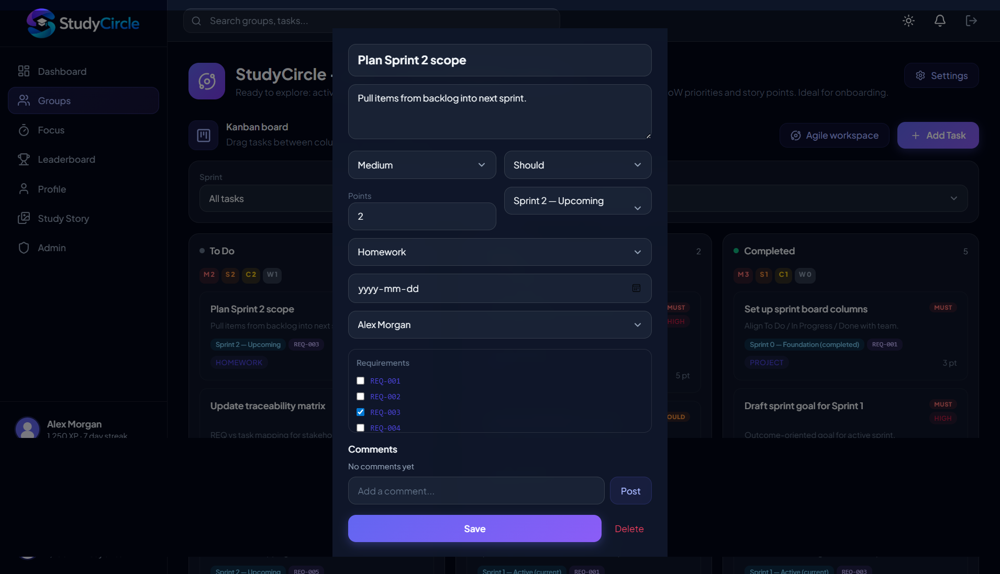

### 5. Focus Timer
Boost productivity with a Pomodoro-style focus timer to stay on track and manage study sessions effectively.
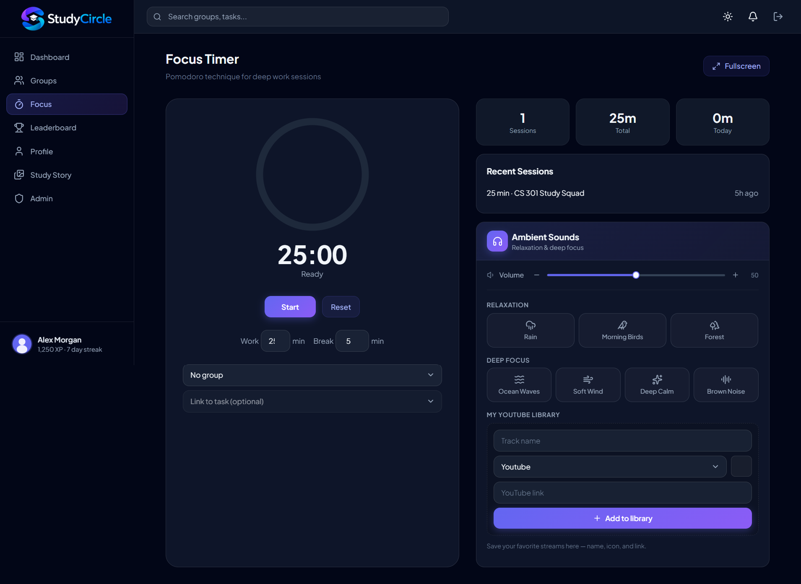


### 6. Leaderboard & Campus Study Stories
Stay motivated and connected with our campus community! View top performers on the leaderboard, discover inspiring study stories from fellow students, and share your own academic journey to inspire others.
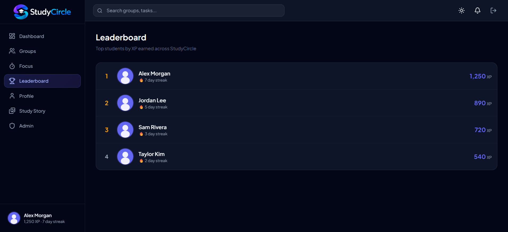

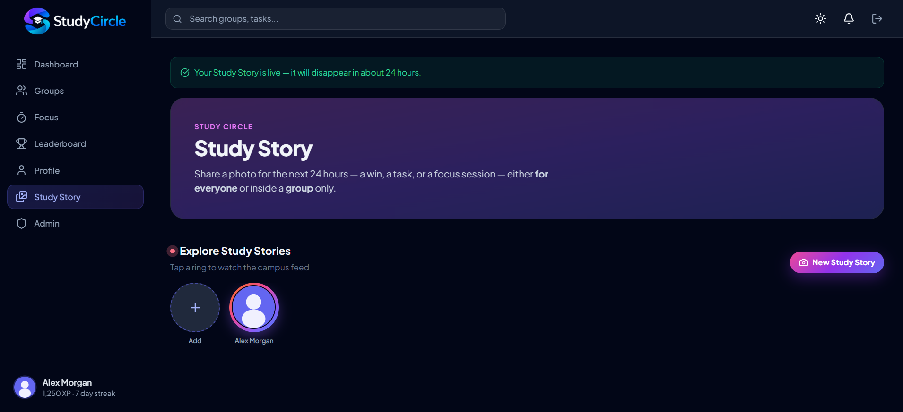

### 7. Profile Page
Personalize your academic identity! Manage your profile details, track your study progress, view your achievements, and showcase your academic journey all in one place.
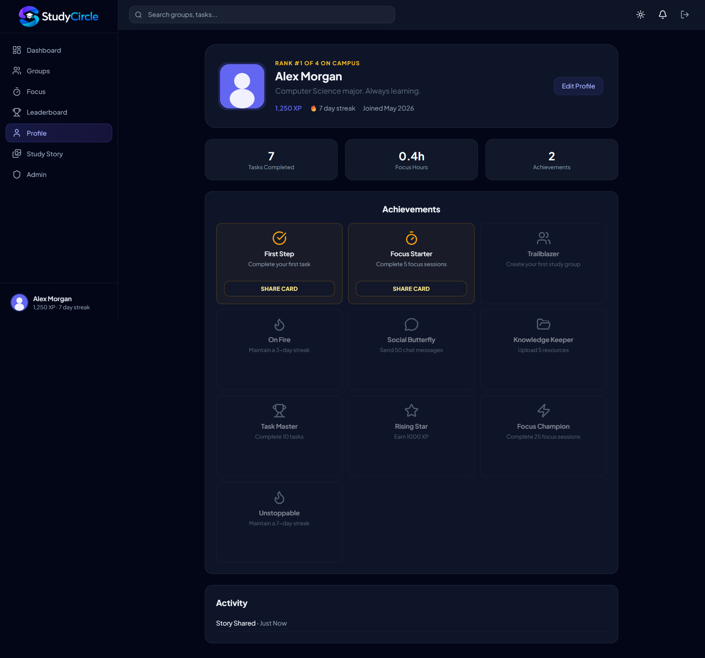

you can share your achievments from profile on study story and make your profile direct link to show all of infromation and achievements you get it and download as image
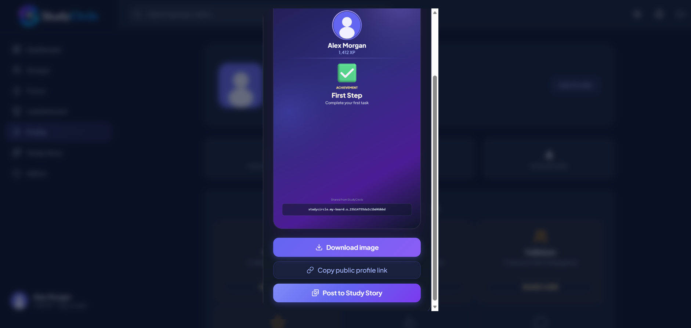

### 8. Admin Panel
Comprehensive platform overview for administrators.
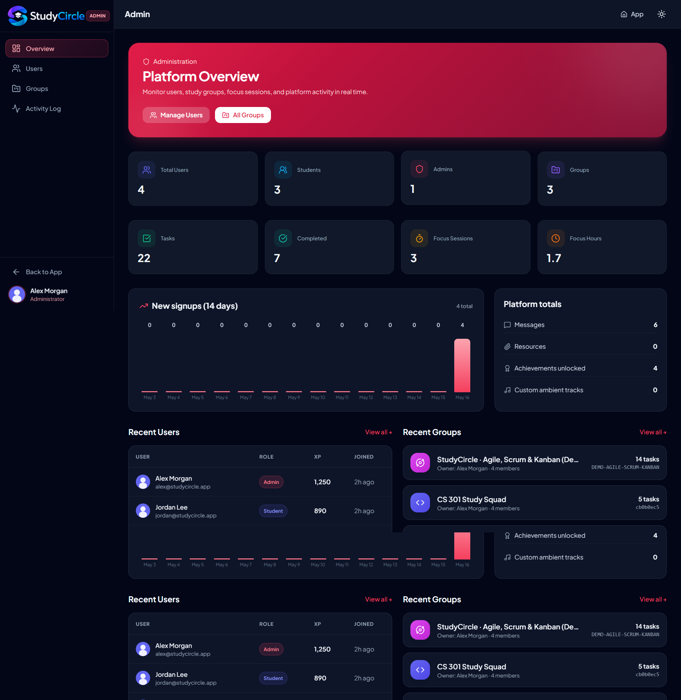

### 8. Light Dashboard
Get a clean, bright overview of your academic world at a glance! Track your upcoming sessions, recent activity, and key stats in a sleek light-themed dashboard designed for clarity and focus.
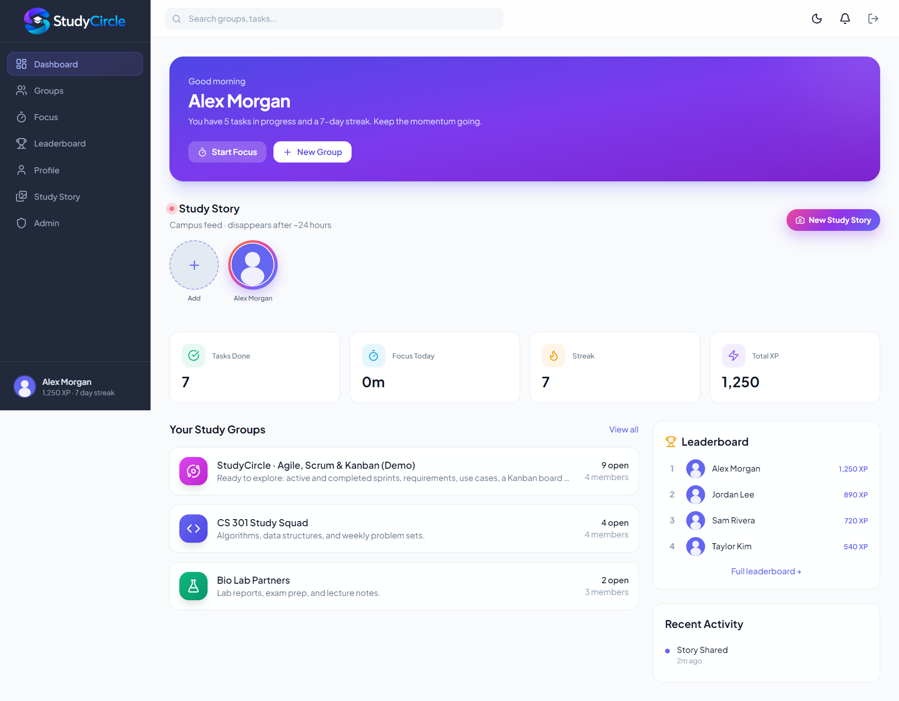

---

## 🛠️ Technical Requirements

To run StudyCircle, your server must meet the following requirements:
- **PHP**: Version 8.0 or higher.
- **Database**: SQLite extension (PDO).
- **Web Server**: Apache with `mod_rewrite` enabled (or Nginx equivalent).

---

## 🚀 Quick Start Guide

Follow these steps to get StudyCircle up and running:

1. **Upload Files**: Upload all project files to your web root directory (e.g., `public_html` or `htdocs/studycircle`).
2. **Enable URL Rewriting**: Ensure Apache `mod_rewrite` is enabled and the `.htaccess` file is properly uploaded.
3. **Set Permissions**: Configure the following folder permissions:
   - `database/` → **755** (Must be writable by PHP)
   - `uploads/` → **755**
4. **Launch**: Visit your site URL. The SQLite database and initial demo data will be created automatically upon the first visit.

### Subfolder Installation
If you are installing StudyCircle in a subfolder (e.g., `yoursite.com/studycircle/`), create a configuration file at `app/config.local.php` with the following content:

```php
<?php
return [
    'app_url' => '/studycircle',
];
```

---

## 🚀 Live Demo

### 🌐 Website
https://studycircle.my-board.org/

### 🔑 Demo Accounts

| Role | Email | Password |
|------|------|------|
| Admin / Product Owner | alex@studycircle.app | password123 |
| Scrum Master | jordan@studycircle.app | password123 |
| Team Member | sam@studycircle.app | password123 |

---

## 🧪 Testing Report

A complete QA and Software Engineering testing process was conducted for the platform, including:

- Functional Testing
- UI/UX Testing
- Validation Testing
- Security Testing
- Performance Testing
- Bug Reporting
- Professional Final Evaluation

### 📄 View Full Testing Report

[](assets_git/Testing_Report.pdf)

---

### ✅ Testing Summary

| Metric | Result |
|---|---|
| Total Test Cases | 25 |
| Passed | 23 |
| Failed | 1 |
| Warnings | 1 |

### ⭐ Professional Evaluation Highlights

- UI/UX → 9/10
- Feature Completeness → 9.5/10
- Security → 8/10
- Academic Project Quality → Exceptional

---

## 🔒 Security Architecture

StudyCircle is built with security as a priority:
- **Database Security**: Utilizes PDO prepared statements to prevent SQL injection. The SQLite database file is protected from direct access via `.htaccess`.
- **Authentication**: Secure password hashing using PHP's native `password_hash()`.
- **CSRF Protection**: Tokens are required and validated on all POST requests.
- **XSS Prevention**: Output is sanitized using a custom `e()` helper function.
- **File Uploads**: Strict MIME type validation is enforced, and the `uploads/` directory is configured to block PHP execution.

---

## 🧪 Testing Strategy

StudyCircle was tested using multiple Software Engineering testing methodologies to ensure reliability, maintainability, and usability.

### ✅ Unit Testing
Individual modules and functions were tested independently, including:
- Authentication validation
- Task creation logic
- Sprint calculations
- File upload validation

### ✅ Integration Testing
Integration testing was performed to verify communication between:
- Kanban board and Sprint system
- Authentication and Session management
- Group chat and database
- Resource uploads and storage system

### ✅ Regression Testing
Regression testing was performed after implementing new features to ensure previously working functionality was not affected.

### ✅ Security Testing
Security-oriented tests included:
- SQL Injection prevention
- XSS prevention
- CSRF validation
- Session security checks
- File upload validation

### ✅ Manual UI/UX Testing
The user interface was tested across:
- Desktop devices
- Tablets
- Mobile devices
- Different screen sizes
- Dark and light themes

### 🧩 Testing Scenarios
The following scenarios were validated:
- User registration and login
- Creating and managing groups
- Drag-and-drop Kanban workflow
- Sprint planning
- Pomodoro focus sessions
- Campus stories publishing
- Chat communication
- Resource sharing

---

## 📚 Software Engineering Context

This project serves as an excellent practical example for Software Engineering courses, demonstrating the application of modern development methodologies:

- **Agile Development**: The platform itself facilitates Agile practices, allowing student teams to manage their coursework using industry-standard frameworks.
- **Scrum Framework**: By incorporating roles (Product Owner, Scrum Master), Sprints, and Story Points, it teaches the mechanics of Scrum.
- **Kanban Methodology**: The visual task board emphasizes limiting Work In Progress (WIP) and optimizing flow.
- **Requirements Engineering**: The traceability features demonstrate how to link high-level requirements to actionable tasks.

---

## 🧠 UML & Analysis Models

Several Software Engineering modeling techniques were applied during the development of StudyCircle.

### 📌 Use Case Modeling
Use Case Diagrams and detailed Use Case Descriptions were created to identify:
- Actors
- Functional requirements
- User-system interactions

### 📌 Sequence Diagrams
Sequence diagrams were designed for critical workflows such as:
- Authentication
- Task management
- Sprint creation
- Resource uploads
- Story publishing

### 📌 Class Diagrams
Integrated UML Class Diagrams were created to represent:
- Entities
- Relationships
- Responsibilities
- System modules

### 📌 Data Flow Diagrams (DFD)
DFD Level 0, Level 1, and Level 2 diagrams were developed to model:
- System data movement
- External entities
- Internal processing flows

### 📌 Architecture Diagrams
Architecture Levels implemented:
- Level 0 → Context Diagram
- Level 1 → Subsystem Architecture
- Level 2 → Component Architecture

These models helped ensure scalability, modularity, and maintainability throughout development.

---

## ⚖️ Software Ethics & Privacy

StudyCircle was designed while considering important Software Engineering ethical principles and privacy practices.

### 🔒 User Privacy
- User passwords are securely hashed.
- Session authentication is protected.
- Sensitive information is never exposed publicly.

### 🛡️ Security Responsibility
The platform applies secure coding practices such as:
- CSRF protection
- XSS escaping
- PDO prepared statements
- Upload validation

### 📚 Educational Integrity
StudyCircle promotes:
- Ethical collaboration
- Responsible teamwork
- Respect for intellectual property
- Constructive academic engagement

### 📄 Copyright & Licensing
- The platform uses open-source technologies responsibly.
- Uploaded educational resources remain the property of their original owners.
- Third-party libraries are used under their respective licenses.

### 🤝 Ethical Collaboration
The system encourages:
- Positive teamwork
- Fair task distribution
- Transparent project management
- Respectful communication

---

## 👤 Contributors & Team Work

| Name | ID | Uni Email |
| :--- | :--- | :--- |
| **yehia mohamed** | `[23101609]` | `[yehia.mohamed.2024@aiu.edu.eg]` |
| **Sohaib Ahmed** | `[id]` | `[sohaib.zakaria.2024@aiu.edu.eg]` |
| **Ahmed Sherif** | `[id]` | `[ahmed.muhammed.2024@aiu.edu.eg]` |
| **Ahmed Abd ElAleem** | `[id]` | `[ahmed.ismail.2024@aiu.edu.eg]` |
| **Zeyad Ali Mohamed** | `[id]` | `[....]` |
| **Abdelrahman Moutafa** | `[id]` | `[abdelrahman.wanas.2024@aiu.edu.eg]` |

## 🚀 Future Improvements

Future planned enhancements for StudyCircle include:

- AI-powered study assistant
- Smart task recommendations
- Automatic sprint generation
- AI-generated quizzes and summaries
- Real-time WebSocket communication
- Mobile application support
- Calendar synchronization
- Push notifications
- Advanced analytics dashboards
- Cloud deployment scaling

These improvements aim to further enhance productivity, collaboration, and learning experiences for students.

---

## 📄 License

This project is licensed under the **MIT License** — built primarily for educational use and open-source collaboration.
